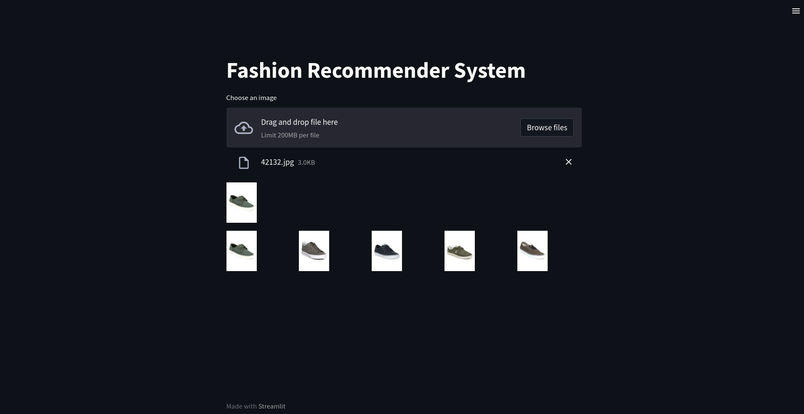

### Fashion Items Reverse Image Search

```
streamlit run app.py
```



## TODO

- [ ] upload the images data to Amazon AWS S3 service.
- [ ] create a flask app and deploy it on Amazon EC2 instance.

https://youtu.be/JKlOlDFwsao -> About AWS S3
